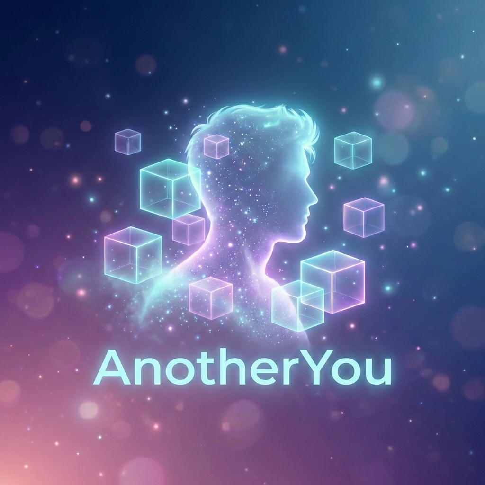

<p align="center">
  
</p>

<h1 align="center">另一个你 - AnotherYou</h1>

<p align="center"><strong>重启你的人生</strong></p>

<p align="center">
  <a href="LICENSE"></a>
  <a href="https://github.com/another-zz/another-you/stargazers"></a>
  <a href="https://discord.gg/xxx"></a>
</p>

**下线后，你的AI分身继续替你活下去**  
一个开源的**持久AI数字人虚拟世界框架**，基于Minecraft，让每个人拥有一个24/7在线、会行走、会思考、会赚钱、会社交的**另一个你**。

---

## ✨ 核心特性

- **持久数字分身**：即使你下线，AI仍自主在世界里行动
- **自然语言指令**：语音/文字下达复杂任务（如"去建一栋带泳池的现代别墅"）
- **无限共享世界**：所有人（+所有AI）的世界实时同步，可形成村庄、城市、社会
- **个性化训练**：AI会模仿你的说话风格、决策习惯、建筑偏好
- **多模态画面**：默认Minecraft方块风，一键切换UE5真实光追
- **经济与社交**：AI自动交易、组队、联盟、建国

---

## 🚀 快速开始（MVP 5分钟跑起来）

```bash
# 1. 克隆项目
git clone https://github.com/another-zz/another-you.git
cd another-you

# 2. 安装依赖
pip install -r requirements.txt

# 3. 启动本地Minecraft服务器 + 你的第一个AI分身
python start.py --mode=local --ai-name="你的名字的分身"

# 4. 在Minecraft客户端连接 localhost:25565
# 5. 在Web面板输入指令试试：
#    "去主城附近建一个木屋，然后去挖10组铁矿"
```

---

## 🛠 技术栈

| 模块 | 技术 |
|------|------|
| **游戏底座** | PaperMC (Minecraft Java 1.21+) |
| **AI大脑** | LangGraph + Grok-4 / Claude 3.5 / Qwen2.5 + Mineflayer |
| **记忆系统** | Chroma / Pinecone 向量数据库（长期记忆） |
| **持久世界** | PostgreSQL + Redis |
| **前端** | React + Tauri（离线指令面板） |
| **渲染** | Minecraft原生 + UE5 Nanite可选 |

---

## 📁 项目结构

```
another-you/
├── agents/          # AI分身核心（分层代理）
├── world/           # 世界生成、物理、数据库
├── ui/              # Web/App指令面板
├── docs/            # 文档
├── examples/        # 指令示例
├── tests/           # 测试用例
├── LICENSE
└── README.md
```

---

## 🎯 路线图（Roadmap）

| 版本 | 目标 |
|------|------|
| **v0.1**（当前）| MVP：单人本地世界 + 简单指令执行 |
| **v0.5** | 多人共享世界 + AI社交 |
| **v1.0** | 1000+ AI同时在线 + 自动建社会 |
| **v2.0** | UE5真实画面 + NFT土地 + 跨平台App |

欢迎PR！一起把"另一个你"做成2026年最酷的开源AI项目！

---

## 🤝 如何贡献

1. **Fork** 本仓库
2. 创建 feature 分支 (`git checkout -b feature/awesome-feature`)
3. 提交改动 (`git commit -m 'Add awesome feature'`)
4. 推送到分支 (`git push origin feature/awesome-feature`)
5. 提交 **Pull Request**

详细贡献指南 → [CONTRIBUTING.md](CONTRIBUTING.md)

---

## 📄 License

本项目采用 **MIT License** —— 自由使用、修改、分发。

---

> "现实暂停，另一个你继续。"

欢迎Star ⭐ 支持我们！
有任何想法随时在 [Issues](https://github.com/another-zz/another-you/issues) 提出～

[](https://star-history.com/#another-zz/another-you&Date)
